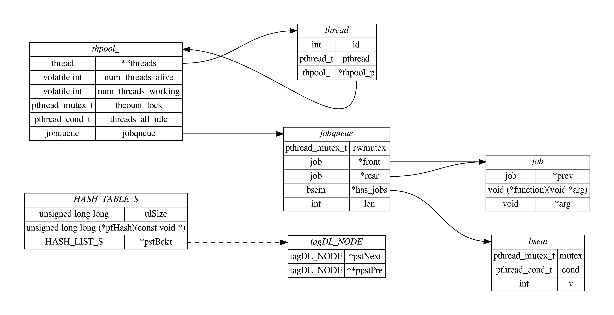

# 结构体关系图

## 功能
- [X] 从 C 源码提取结构提
- [X] 解析结构体关系
- [X] 解析链接
- [X] 根据结构体和链接绘制图片
- [ ] 避免名称冲突

## [C-Thread-Pool](https://github.com/Pithikos/C-Thread-Pool) 关系图


## 提取结构体

```sh
cat *.c | python3 ./extract_struct.py | sed -E  's/typedef *//' | sed -E 's/^}.*/};/' | sed -E '/\/\*/{:start /\*\//!{N;b start};s/\/\*.*\*\///}' | sed -E 's#/\*.*\*/##'  | sed -E '/^ *$/d' > struct.txt
```

## 结构体绘图

Centos 安装 `graphviz`：
```
yum install graphviz -y
```

绘制关系图：
```sh
cat struct.txt | python3 ./generate_rel.py > tmpfile.txt
dot -Tsvg tmpfile.txt -o out.svg
# dot -Tsvg tmpfile.txt -o out.png
```

## 参考与致谢
- [结构体关系图项目](https://github.com/zhoupro/structs_relation/tree/main)
