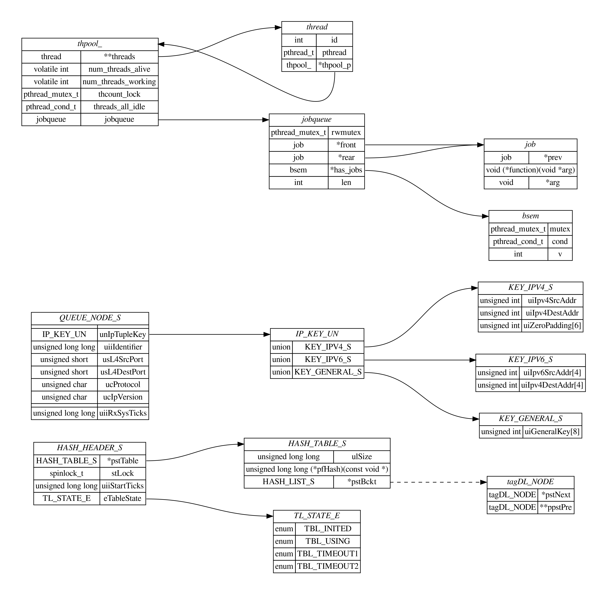

# 结构体关系图

## 功能
- [X] 从 C 源码提取结构提
- [X] 解析结构体关系
- [X] 解析链接
- [X] 根据结构体和链接绘制图片
- [ ] 避免名称冲突

## [C-Thread-Pool](https://github.com/Pithikos/C-Thread-Pool) 关系图


## 提取结构体

```sh
cat *.c | python3 ./extract_struct.py \
    | sed -E  's/typedef *//' \
    | sed -E 's/^}.*/};/' \
    | sed -E '/\/\*/{:start /\*\//!{N;b start};s/\/\*.*\*\///}' \
    | sed -E 's#/\*.*\*/##' \
    | sed -E '/^ *$/d' > struct.txt
```

> 如果有 `typedef` 结构体，要保持 `typedef struct xyzabc {...} xyzabc;`，重命名要跟结构体名一致，否则可能出现关系图不正确。

## 结构体绘图

Centos 安装 `graphviz`：
```
yum install graphviz -y
```

绘制关系图：
```sh
cat struct.txt | python3 ./generate_relation.py > out.dot
dot -T png -Gdpi=300 -o out.png out.dot
```

[在线绘制网站](https://dreampuf.github.io/GraphvizOnline/#%0D%0Adigraph%20%7B%0D%0A%20%20%20%20graph%20%5Bpad%3D%220.5%22%2C%20nodesep%3D%220.5%22%2C%20ranksep%3D%222%22%2C%20dpi%3D100%5D%3B%0D%0A%20%20%20%20node%20%5Bshape%3Dplain%5D%0D%0A%20%20%20%20rankdir%3DLR%3B%0D%0A%20%20%20%20thpool_%20%5Blabel%3D%3C%0D%0A%20%20%20%20%20%20%20%20%3Ctable%20border%3D%220%22%20cellborder%3D%221%22%20cellspacing%3D%220%22%3E%0D%0A%20%20%20%20%20%20%20%20%3Ctr%3E%3Ctd%20colspan%3D%222%22%20port%3D%22head%22%3E%3Ci%3Ethpool_%3C%2Fi%3E%3C%2Ftd%3E%3C%2Ftr%3E%0D%0A%20%20%20%20%3Ctr%3E%3Ctd%3Ejobqueue%3C%2Ftd%3E%3Ctd%20port%3D%22jobqueue%22%3Ejobqueue%3C%2Ftd%3E%3C%2Ftr%3E%0D%0A%20%20%20%20%3Ctr%3E%3Ctd%3Epthread_cond_t%3C%2Ftd%3E%3Ctd%20port%3D%22threads_all_idle%22%3Ethreads_all_idle%3C%2Ftd%3E%3C%2Ftr%3E%0D%0A%20%20%20%20%3Ctr%3E%3Ctd%3Epthread_mutex_t%3C%2Ftd%3E%3Ctd%20port%3D%22thcount_lock%22%3Ethcount_lock%3C%2Ftd%3E%3C%2Ftr%3E%0D%0A%20%20%20%20%3Ctr%3E%3Ctd%3Evolatile%20int%3C%2Ftd%3E%3Ctd%20port%3D%22num_threads_working%22%3Enum_threads_working%3C%2Ftd%3E%3C%2Ftr%3E%0D%0A%20%20%20%20%3Ctr%3E%3Ctd%3Evolatile%20int%3C%2Ftd%3E%3Ctd%20port%3D%22num_threads_alive%22%3Enum_threads_alive%3C%2Ftd%3E%3C%2Ftr%3E%0D%0A%20%20%20%20%3Ctr%3E%3Ctd%3Ethread%3C%2Ftd%3E%3Ctd%20port%3D%22__threads%22%3E**threads%3C%2Ftd%3E%3C%2Ftr%3E%0D%0A%20%20%20%20%3C%2Ftable%3E%3E%5D%3B%0D%0A%20%20%20%20thread%20%5Blabel%3D%3C%0D%0A%20%20%20%20%20%20%20%20%3Ctable%20border%3D%220%22%20cellborder%3D%221%22%20cellspacing%3D%220%22%3E%0D%0A%20%20%20%20%20%20%20%20%3Ctr%3E%3Ctd%20colspan%3D%222%22%20port%3D%22head%22%3E%3Ci%3Ethread%3C%2Fi%3E%3C%2Ftd%3E%3C%2Ftr%3E%0D%0A%20%20%20%20%3Ctr%3E%3Ctd%3Ethpool_%3C%2Ftd%3E%3Ctd%20port%3D%22_thpool_p%22%3E*thpool_p%3C%2Ftd%3E%3C%2Ftr%3E%0D%0A%20%20%20%20%3Ctr%3E%3Ctd%3Epthread_t%3C%2Ftd%3E%3Ctd%20port%3D%22pthread%22%3Epthread%3C%2Ftd%3E%3C%2Ftr%3E%0D%0A%20%20%20%20%3Ctr%3E%3Ctd%3Eint%3C%2Ftd%3E%3Ctd%20port%3D%22id%22%3Eid%3C%2Ftd%3E%3C%2Ftr%3E%0D%0A%20%20%20%20%3C%2Ftable%3E%3E%5D%3B%0D%0A%20%20%20%20jobqueue%20%5Blabel%3D%3C%0D%0A%20%20%20%20%20%20%20%20%3Ctable%20border%3D%220%22%20cellborder%3D%221%22%20cellspacing%3D%220%22%3E%0D%0A%20%20%20%20%20%20%20%20%3Ctr%3E%3Ctd%20colspan%3D%222%22%20port%3D%22head%22%3E%3Ci%3Ejobqueue%3C%2Fi%3E%3C%2Ftd%3E%3C%2Ftr%3E%0D%0A%20%20%20%20%3Ctr%3E%3Ctd%3Eint%3C%2Ftd%3E%3Ctd%20port%3D%22len%22%3Elen%3C%2Ftd%3E%3C%2Ftr%3E%0D%0A%20%20%20%20%3Ctr%3E%3Ctd%3Ebsem%3C%2Ftd%3E%3Ctd%20port%3D%22_has_jobs%22%3E*has_jobs%3C%2Ftd%3E%3C%2Ftr%3E%0D%0A%20%20%20%20%3Ctr%3E%3Ctd%3Ejob%3C%2Ftd%3E%3Ctd%20port%3D%22_rear%22%3E*rear%3C%2Ftd%3E%3C%2Ftr%3E%0D%0A%20%20%20%20%3Ctr%3E%3Ctd%3Ejob%3C%2Ftd%3E%3Ctd%20port%3D%22_front%22%3E*front%3C%2Ftd%3E%3C%2Ftr%3E%0D%0A%20%20%20%20%3Ctr%3E%3Ctd%3Epthread_mutex_t%3C%2Ftd%3E%3Ctd%20port%3D%22rwmutex%22%3Erwmutex%3C%2Ftd%3E%3C%2Ftr%3E%0D%0A%20%20%20%20%3C%2Ftable%3E%3E%5D%3B%0D%0A%20%20%20%20job%20%5Blabel%3D%3C%0D%0A%20%20%20%20%20%20%20%20%3Ctable%20border%3D%220%22%20cellborder%3D%221%22%20cellspacing%3D%220%22%3E%0D%0A%20%20%20%20%20%20%20%20%3Ctr%3E%3Ctd%20colspan%3D%222%22%20port%3D%22head%22%3E%3Ci%3Ejob%3C%2Fi%3E%3C%2Ftd%3E%3C%2Ftr%3E%0D%0A%20%20%20%20%3Ctr%3E%3Ctd%3Evoid%3C%2Ftd%3E%3Ctd%20port%3D%22_arg%22%3E*arg%3C%2Ftd%3E%3C%2Ftr%3E%0D%0A%20%20%20%20%3Ctr%3E%3Ctd%20colspan%3D%222%22%20port%3D%22function%22%3Evoid%20(*function)(void%20*arg)%3C%2Ftd%3E%3C%2Ftr%3E%0D%0A%20%20%20%20%3Ctr%3E%3Ctd%3Ejob%3C%2Ftd%3E%3Ctd%20port%3D%22_prev%22%3E*prev%3C%2Ftd%3E%3C%2Ftr%3E%0D%0A%20%20%20%20%3C%2Ftable%3E%3E%5D%3B%0D%0A%20%20%20%20bsem%20%5Blabel%3D%3C%0D%0A%20%20%20%20%20%20%20%20%3Ctable%20border%3D%220%22%20cellborder%3D%221%22%20cellspacing%3D%220%22%3E%0D%0A%20%20%20%20%20%20%20%20%3Ctr%3E%3Ctd%20colspan%3D%222%22%20port%3D%22head%22%3E%3Ci%3Ebsem%3C%2Fi%3E%3C%2Ftd%3E%3C%2Ftr%3E%0D%0A%20%20%20%20%3Ctr%3E%3Ctd%3Eint%3C%2Ftd%3E%3Ctd%20port%3D%22v%22%3Ev%3C%2Ftd%3E%3C%2Ftr%3E%0D%0A%20%20%20%20%3Ctr%3E%3Ctd%3Epthread_cond_t%3C%2Ftd%3E%3Ctd%20port%3D%22cond%22%3Econd%3C%2Ftd%3E%3C%2Ftr%3E%0D%0A%20%20%20%20%3Ctr%3E%3Ctd%3Epthread_mutex_t%3C%2Ftd%3E%3Ctd%20port%3D%22mutex%22%3Emutex%3C%2Ftd%3E%3C%2Ftr%3E%0D%0A%20%20%20%20%3C%2Ftable%3E%3E%5D%3B%0D%0A%20%20%20%20thpool_%3Ajobqueue-%3Ejobqueue%3Ahead%0D%0A%20%20%20%20thpool_%3A__threads-%3Ethread%3Ahead%0D%0A%20%20%20%20thread%3A_thpool_p-%3Ethpool_%3Ahead%0D%0A%20%20%20%20jobqueue%3A_has_jobs-%3Ebsem%3Ahead%0D%0A%20%20%20%20jobqueue%3A_rear-%3Ejob%3Ahead%0D%0A%20%20%20%20jobqueue%3A_front-%3Ejob%3Ahead%0D%0A%20%20%20%20job%3A_prev-%3Ejob%3Ahead%0D%0A%7D%0D%0A)绘制 `out.dot` 中的关系图。

## 参考与致谢
- [结构体关系图项目](https://github.com/zhoupro/structs_relation/tree/main)
